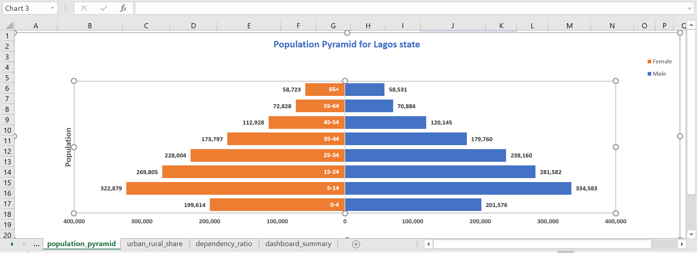
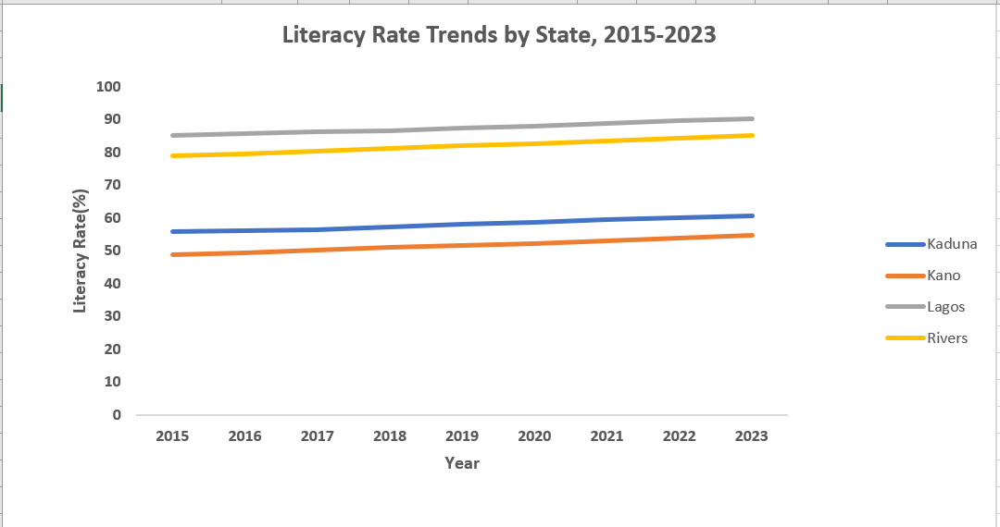

# Demographic & Social Data Analysis Portfolio

## End-to-End Excel Data Analysis Project

This project demonstrates an end-to-end data analysis workflow using Microsoft Excel. It covers data cleaning, population analysis, demographic visualization, trend analysis, statistical testing, regression, and the communication of findings in clear business language.

The project uses synthetic Nigerian demographic and social datasets created for analytical practice. The results should therefore not be interpreted as official Nigerian government statistics.

## Project Objectives

The project was designed to demonstrate my ability to:
- clean and prepare messy real-world-style datasets;
- use Power Query for data transformation;
- build PivotTables and PivotCharts;
- summarize population and demographic patterns;
- calculate percentage changes and dependency ratios;
- analyze trends over time;
- measure correlation;
- apply confidence intervals and hypothesis testing;
- perform chi-square analysis and linear regression;
- communicate technical findings in simple, decision-focused language.

## Tools Used

- Microsoft Excel
- Power Query
- PivotTables and PivotCharts
- Excel Data Analysis ToolPak
- Descriptive Statistics
- CONFIDENCE.T
- CORREL
- CHISQ.TEST
- Two-Sample t-Test
- Linear Regression
- IF and lookup logic
- Data visualization
- Statistical interpretation

## Project 1 — Household Survey Data Cleaning

The first stage focused on cleaning a deliberately messy household survey dataset.

### Data Quality Issues Identified
- inconsistent state names and text casing;
- duplicate household IDs;
- completely blank records;
- missing age values;
- inconsistent education categories;
- inconsistent marital-status entries;
- mixed survey-date formats;
- leading and trailing whitespace.

### Cleaning Outcome
The dataset contained 1,530 raw rows. After cleaning:
- 5 completely blank rows were removed;
- 25 duplicate household records were removed;
- 31 missing ages were imputed using state-level median ages;
- state, education and marital-status categories were standardized;
- mixed survey dates were converted into one consistent format;
- respondent names and other text fields were trimmed.

The final dataset contained **1,500 unique household records**.

## Project 2 — Population Analysis

The second stage analyzed population patterns by state, LGA, residence type, sex and age group.

The analysis included:
- total population by state;
- urban versus rural population share;
- dependency ratio;
- dashboard-ready state summary;
- population pyramid by age group and sex.

### Selected Findings
- Kano had the largest total population in the synthetic dataset at approximately 3.01 million.
- Lagos followed at approximately 2.92 million.
- Urban population shares were close to 65% across the states.
- Kaduna recorded the highest calculated dependency ratio at approximately 68.3 dependants per 100 working-age people.

### Population Pyramid


## Project 3 — Social Indicator Trend Analysis

The third stage examined changes in literacy, fertility, under-five mortality and primary-school enrolment between 2015 and 2023.

### Key Findings
- Kano recorded the highest percentage improvement in literacy at approximately 12.27%.
- Lagos recorded the largest percentage reduction in under-five mortality at approximately 40.43%.
- Plateau recorded the highest percentage improvement in primary-school enrolment at approximately 7.73%.
- Literacy and under-five mortality showed a very strong negative correlation in 2023 (r ≈ -0.978).

The correlation indicates an association and should not be interpreted as proof that literacy directly caused lower mortality.

### Literacy Trend


## Project 4 — Statistical Inference

The final stage used the cleaned household survey data to move beyond descriptive analysis and test statistical relationships.

### Descriptive Statistics
Average age was approximately **34.30 years**, with a median of **34 years**.

Mean monthly income was **₦59,780.29**, compared with a median of **₦49,481**. Income had a skewness value of **4.03**, showing a strong right-skew. The median therefore provided a more representative picture of typical income than the mean.

### 95% Confidence Interval
Overall mean monthly income: **₦56,679.24 – ₦62,881.34**

Lagos State: **₦53,730.26 – ₦72,209.36**

### Male vs Female Monthly Income
A two-sample t-test produced **p = 0.350**. There was no statistically significant difference between male and female mean monthly income.

### Education and Employment Status
The chi-square test produced **p ≈ 0.810**. No statistically significant association was found between education level and employment status.

### Education and Monthly Income
Simple linear regression produced:
- R² = **0.00195**
- Education coefficient = **₦1,523.47**
- p-value = **0.297**

Education level explained only around **0.2%** of the variation in monthly income and was not a statistically significant predictor in this dataset. The regression identifies association only and does not prove causation.

## Skills Demonstrated
- Data Cleaning
- Data Validation
- Power Query
- Exploratory Data Analysis
- PivotTables
- Data Aggregation
- Demographic Analysis
- Data Visualization
- Statistical Analysis
- Hypothesis Testing
- Correlation Analysis
- Regression Analysis
- Data Storytelling
- Business Reporting

## Repository Structure

```text
data/
    raw/
    processed/

excel/
    project1_data_cleaning.xlsx
    project2_population_analysis.xlsx
    project3_social_indicator_analysis.xlsx
    project4_statistical_inference.xlsx

images/
    population_pyramid.png
    literacy_rate_trend.png

reports/
    executive_summary.pdf 
    statistical_inference_memo.pdf
```

## Data Note
The datasets used in this project are synthetic and were created for practice. They are structured to resemble demographic and social datasets but should not be treated as official statistics.

## Author
Doris Twumasi Martins

Data Analyst

Skills: Excel | Power Query | Data Cleaning | Data Visualization | Statistical Analysis

LinkedIn: linkedin.com/in/doris-twumasi
